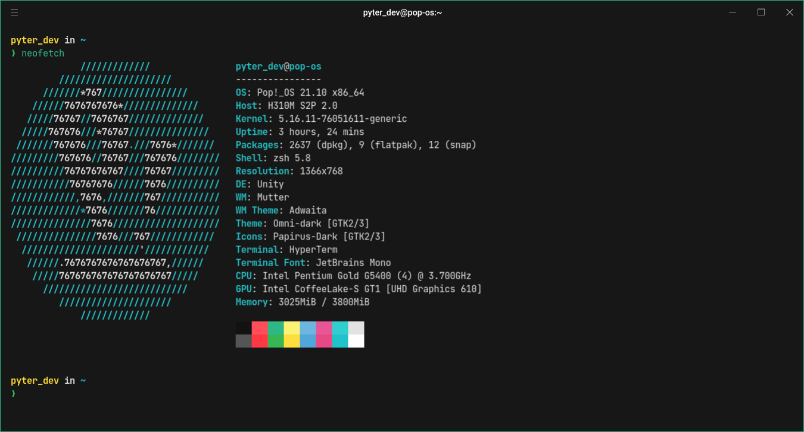

<h1 align="center">
  
  <br />
  Bit Theme for <a href="https://hyper.is">Hyper</a>
</h1>

<p align="center">
  
  
  
</p>



## Install

- Open Hyper.
- Run `hyper install hyper-bit-theme`.
- And ready.

## Choosing a variant

Three theme variants are available: `default`, `soft` and `intense`.

To define a variant you must edit your `.hyper.js` configuration file as follows. If no variant is defined the default theme will be applied.

``` js

module.exports = {
  config: {
      /*
        Other settings hidden
      */

     bitThemeConfig: {
       variant: '[variant-name]'
     }
    },
  };

```

The `intense` variant would be defined as follows:

``` js

module.exports = {
  config: {
      /*
        Other settings hidden
      */

     bitThemeConfig: {
       variant: 'intense'
     }
    },
  };

```
